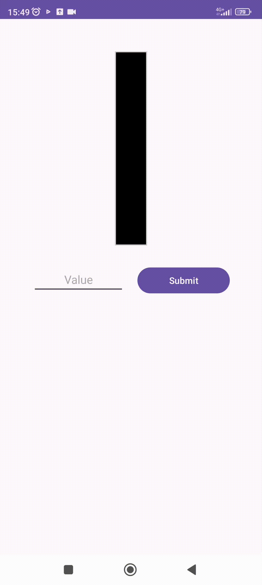

# **Custom Progress Bar** :bar_chart:
### On this repository you can find custom progress bar view
  
___
### Application Preview:

### Progress Bar Values:
- `value` - floating point number that defines the progress bar filling
  -  `0.5f` by default 
- `borderColor` - color of the progress bar border
  -  `#cccccc` by default
- `backgroundColor` - background color of the progress bar
  - `#000000` by default
- `borderWidth` - width of the progress bar border
  - `10f` by default
 
:exclamation: **To change progress bar value, use `setProgress()` method**

#### About App:
- #### Supported android versions :hammer:: 9.0 and higher
- #### Memory size :minidisc:: 31 MB
